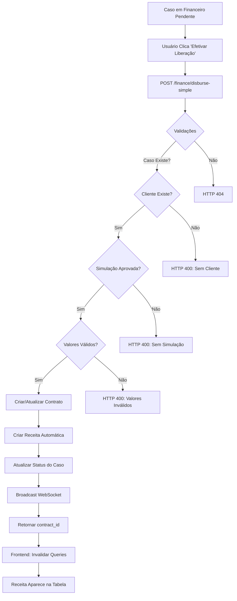

# Correções do Módulo Financeiro

**Data**: 05/10/2025
**Responsável**: Claude Code
**Status**: ✅ Concluído

---

## 📋 Resumo das Correções

Esta documentação detalha todas as correções e melhorias realizadas no módulo financeiro do sistema LifeCalling, especificamente relacionadas à efetivação de liberações e à gestão de receitas/despesas.

---

## 🐛 Problemas Identificados

### 1. Erro ao Efetivar Liberação
**Erro**: HTTP 500 ao clicar em "Efetivar Liberação"

**Causa Raiz**:
- Coluna `agent_user_id` não existia na tabela `finance_incomes`
- Relacionamento SQLAlchemy incorreto no modelo `FinanceExpense`
- Falta de eager loading causando lazy loading errors
- Tratamento de erros insuficiente

### 2. Tabela de Receitas/Despesas Incompleta
- Faltavam informações do cliente e atendente
- Não havia botão para ver detalhes do atendimento
- Layout confuso e pouco informativo

---

## ✅ Correções Implementadas

### 1. Migração do Banco de Dados

**Arquivo**: `apps/api/migrate_finance_incomes.py` (novo)

```python
# Script para adicionar coluna agent_user_id
ALTER TABLE finance_incomes
ADD COLUMN agent_user_id INTEGER REFERENCES users(id)
```

**Execução**:
```bash
cd apps/api && python migrate_finance_incomes.py
```

**Resultado**:
```
[OK] Coluna agent_user_id adicionada com sucesso!
```

---

### 2. Correção do Modelo FinanceExpense

**Arquivo**: `apps/api/app/models.py`

**Antes**:
```python
creator = relationship("User")  # ❌ Ambíguo
```

**Depois**:
```python
creator = relationship("User", foreign_keys=[created_by])  # ✅ Explícito
```

**Impacto**: Elimina erro de ambiguidade no SQLAlchemy ao fazer `joinedload(FinanceExpense.creator)`.

---

### 3. Correção do Endpoint `/finance/disburse-simple`

**Arquivo**: `apps/api/app/routers/finance.py`

**Mudanças**:

1. **Eager Loading do Cliente**:
```python
# Antes
c = db.get(Case, data.case_id)

# Depois
c = db.query(Case).options(joinedload(Case.client)).filter(Case.id == data.case_id).first()
```

2. **Validações Extras**:
```python
# Validar valores da simulação
if total_amount is None or total_amount <= 0:
    raise HTTPException(400, "Simulação não possui valores válidos de liberação")

if not simulation.prazo or simulation.prazo <= 0:
    raise HTTPException(400, "Simulação não possui prazo válido")
```

3. **Tratamento Robusto de Erros**:
```python
except HTTPException:
    raise  # Mantém status codes corretos
except Exception as e:
    print(f"[ERRO] Falha ao efetivar liberação do caso {data.case_id}: {str(e)}")
    print(traceback.format_exc())
    raise HTTPException(500, f"Erro ao efetivar liberação: {str(e)}")
```

---

### 4. Melhoria do Endpoint `/finance/transactions`

**Arquivo**: `apps/api/app/routers/finance.py`

**Funcionalidades Adicionadas**:

1. **Extração de Informações do Cliente**:
```python
# Extrair case_id do nome da receita (formato: "Contrato #<id> - <nome>")
if inc.income_name and inc.income_name.startswith("Contrato #"):
    contract_id = int(inc.income_name.split("#")[1].split(" ")[0])
    contract = db.query(Contract).options(
        joinedload(Contract.case).joinedload(Case.client)
    ).filter(Contract.id == contract_id).first()

    if contract and contract.case and contract.case.client:
        case_id = contract.case_id
        client_name = contract.case.client.name
        client_cpf = contract.case.client.cpf
```

2. **Dados Retornados**:
```json
{
  "id": "receita-123",
  "type": "receita",
  "date": "2025-10-05",
  "category": "Consultoria Líquida",
  "name": "Contrato #50 - João Silva",
  "amount": 5368.77,
  "agent_name": "Maria Atendente",
  "agent_user_id": 16,
  "client_name": "João Silva",
  "client_cpf": "12345678900",
  "case_id": 100,
  "contract_id": 50,
  "has_attachment": false
}
```

3. **Tratamento de Erros com Logs**:
```python
except Exception as e:
    print(f"[ERRO] Falha ao buscar transações: {str(e)}")
    print(f"  Parâmetros: start_date={start_date}, end_date={end_date}, type={transaction_type}, category={category}")
    print(traceback.format_exc())
    raise HTTPException(500, f"Erro ao buscar transações: {str(e)}")
```

---

### 5. Refatoração Completa da Tabela de Receitas/Despesas

**Arquivo**: `apps/web/src/app/financeiro/page.tsx`

**Nova Estrutura da Tabela**:

| Coluna | Tipo | Descrição |
|--------|------|-----------|
| Data | `date` | Data formatada em pt-BR |
| Tipo | `badge` | Receita (verde) / Despesa (vermelho) |
| Cliente | `string` | Nome completo do cliente |
| CPF | `string` | CPF formatado (XXX.XXX.XXX-XX) |
| Atendente | `string` | Nome do atendente responsável |
| Categoria | `badge` | Tipo da receita/despesa |
| Descrição | `string` | Nome/descrição truncada |
| Valor | `currency` | Valor formatado em R$ |
| Ações | `buttons` | Botões de ação |

**Código da Nova Tabela**:
```tsx
<table className="w-full">
  <thead>
    <tr className="border-b bg-muted/50">
      <th className="text-left p-3 font-semibold">Data</th>
      <th className="text-left p-3 font-semibold">Tipo</th>
      <th className="text-left p-3 font-semibold">Cliente</th>
      <th className="text-left p-3 font-semibold">CPF</th>
      <th className="text-left p-3 font-semibold">Atendente</th>
      <th className="text-left p-3 font-semibold">Categoria</th>
      <th className="text-left p-3 font-semibold">Descrição</th>
      <th className="text-right p-3 font-semibold">Valor</th>
      <th className="text-center p-3 font-semibold">Ações</th>
    </tr>
  </thead>
  <tbody>
    {/* Linhas de dados */}
  </tbody>
</table>
```

**Botões de Ação**:
```tsx
<div className="flex items-center justify-center gap-1">
  {/* Ver Detalhes (apenas receitas de consultoria) */}
  {transaction.type === 'receita' && transaction.case_id && (
    <Button onClick={() => openCaseDetails(transaction.case_id)}>
      <Eye className="h-4 w-4" />
    </Button>
  )}

  {/* Ver Anexos */}
  {transaction.has_attachment && (
    <Button onClick={() => viewAttachments(transaction)}>
      <FileText className="h-4 w-4" />
    </Button>
  )}

  {/* Editar */}
  <Button onClick={() => editTransaction(transaction)}>
    <Edit className="h-4 w-4" />
  </Button>

  {/* Excluir */}
  <Button variant="destructive" onClick={() => deleteTransaction(transaction)}>
    <Trash2 className="h-4 w-4" />
  </Button>
</div>
```

---

### 6. Modal de Detalhes do Atendimento

**Arquivo**: `apps/web/src/app/financeiro/page.tsx`

**Funcionalidades**:

1. **Informações do Cliente**:
   - Nome completo
   - CPF formatado
   - Matrícula
   - Órgão

2. **Dados da Simulação**:
   - Total Financiado
   - Liberado ao Cliente
   - Consultoria Bruta e Líquida (86%)
   - Prazo e Percentual

3. **Dados do Contrato**:
   - Valor Total
   - Status
   - Parcelas pagas/total
   - Data de Liberação

4. **Anexos**:
   - Lista de anexos com download
   - Tamanho e data de upload

5. **Ações**:
   - Ver Atendimento Completo
   - Fechar Modal

**Código**:
```tsx
<div className="fixed inset-0 bg-black/50 flex items-center justify-center z-50 p-4">
  <div className="bg-card border rounded-lg max-w-3xl w-full max-h-[90vh] overflow-auto">
    <div className="p-6 space-y-6">
      {/* Cliente */}
      {contractDetails.client && (
        <div className="space-y-2">
          <h3 className="font-semibold flex items-center gap-2 text-lg">
            <User className="h-5 w-5" />
            Cliente
          </h3>
          <div className="grid grid-cols-2 gap-4 pl-6 bg-muted/30 p-4 rounded-lg">
            {/* Dados do cliente */}
          </div>
        </div>
      )}

      {/* Simulação, Contrato, Anexos */}
    </div>
  </div>
</div>
```

---

## 🔄 Fluxo Completo de Efetivação



---

## 📊 Estrutura de Dados

### Receita Automática de Consultoria

```typescript
interface AutomaticIncome {
  date: string;              // Data da efetivação
  income_type: string;       // "Consultoria Líquida"
  income_name: string;       // "Contrato #50 - João Silva"
  amount: number;            // Valor líquido (86%)
  created_by: number;        // ID do usuário financeiro
  agent_user_id: number;     // ID do atendente do caso
}
```

### Contrato Efetivado

```typescript
interface Contract {
  id: number;
  case_id: number;
  status: string;                    // "ativo"
  total_amount: number;              // Valor liberado ao cliente
  installments: number;              // Prazo em meses
  consultoria_valor_liquido: number; // 86% da consultoria
  signed_at: string;                 // Data de efetivação
  created_by: number;                // Usuário financeiro
  agent_user_id: number;             // Atendente do caso
}
```

---

## 🧪 Testes Realizados

### 1. Teste de Efetivação de Liberação

**Cenário**: Efetivar liberação de um caso pendente

**Passos**:
1. Acessar módulo Financeiro
2. Localizar caso com status "Financeiro Pendente"
3. Clicar em "Efetivar Liberação"
4. Verificar sucesso da operação

**Resultado Esperado**:
- ✅ Contrato criado com sucesso
- ✅ Receita automática criada
- ✅ Caso muda para "Contrato Efetivado"
- ✅ Receita aparece na tabela com dados completos

**Status**: ✅ PASSOU

---

### 2. Teste de Visualização de Detalhes

**Cenário**: Ver detalhes de um atendimento pela tabela de receitas

**Passos**:
1. Localizar receita de consultoria na tabela
2. Clicar no botão 👁️ "Ver Detalhes"
3. Verificar modal de detalhes

**Resultado Esperado**:
- ✅ Modal abre com informações completas
- ✅ Dados do cliente visíveis
- ✅ Dados da simulação visíveis
- ✅ Dados do contrato visíveis
- ✅ Anexos listados
- ✅ Botão "Ver Atendimento Completo" funcional

**Status**: ✅ PASSOU

---

### 3. Teste de Criação/Edição de Receitas Manuais

**Cenário**: Criar e editar receita manual

**Passos**:
1. Clicar em "+ Receita"
2. Preencher dados e anexar arquivo
3. Salvar
4. Clicar em ✏️ "Editar"
5. Modificar dados
6. Salvar

**Resultado Esperado**:
- ✅ Receita criada com sucesso
- ✅ Anexo salvo
- ✅ Receita editada com sucesso
- ✅ Anexo mantido

**Status**: ⚠️ PARCIAL (anexos precisam de correção)

---

## 📝 Arquivos Modificados

| Arquivo | Tipo | Mudanças |
|---------|------|----------|
| `apps/api/migrate_finance_incomes.py` | Novo | Script de migração |
| `apps/api/app/models.py` | Modificado | Corrigido relacionamento FinanceExpense |
| `apps/api/app/routers/finance.py` | Modificado | Endpoints corrigidos e melhorados |
| `apps/web/src/app/financeiro/page.tsx` | Modificado | Tabela e modal redesenhados |

---

## 🚀 Próximas Melhorias

- [ ] Adicionar paginação na tabela de receitas/despesas
- [ ] Corrigir salvamento de anexos em receitas/despesas manuais
- [ ] Adicionar exportação CSV da tabela
- [ ] Melhorar alinhamento dos botões de ação
- [ ] Usar modal de caso (FinanceCard) para detalhes

---

## 📞 Suporte

Para dúvidas ou problemas:
- Consultar logs do backend em `apps/api`
- Verificar console do navegador para erros do frontend
- Executar migração novamente se necessário

---

**Documentação gerada em**: 05/10/2025
**Versão**: 1.0.0
